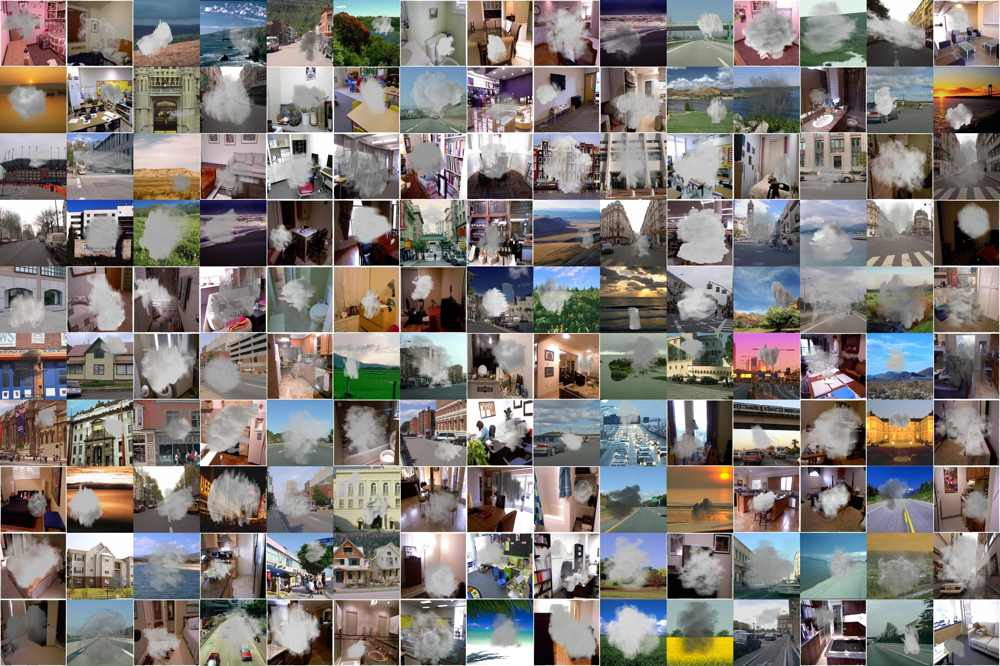

# News
* **2020-11-09** Amount of images in each subset of **Smoke100k** are all increased to 40k now.

## Abstract

Due to the complex scenarios and the limited feature information in a single image, a precise smoke detection is much more challenging in practice. Most of previous smoke detection methods either extract textural and spatiotemporal characteristics of smoke or separate the smoke and background components of the image. However, those methods often fail in detecting smoke positions because of the limited feature information within a single image. Moreover, the task of smoke detection can be better achieved if the extra information from collected training dataset is available. One key issue is how to build a training dataset of paired smoke images and ground-truth bounding box positions for end-to-end learning. This paper proposes a large-scale benchmark image dataset to train a smoke detector. With the built dataset, experimental results demonstrate that the discriminative models can be effectively trained as the smoke detector to detect the smoldering fires precisely.

## Details

**Smoke100k** consists of 100k synthesized smoke image, smoke free image, smoke mask, and bounding box positions.

There are 3 subsets of synthesized smoke images for simulation of different smoldering fires as follows:

* _Smoke100k-L_: samples are synthesized by smoke masks selected from the Low level with twenty kinds of angles,
* _Smoke100k-M_: samples are synthesized by smoke masks selected from the Middle level with eight kinds of angles,
* _Smoke100k-H_: samples are synthesized by smoke masks selected from the High level with fifteen kinds of angles.

For more details of the dataset, please refer to the paper [Smoke 100k: A Database for Smoke Detection](https://ieeexplore.ieee.org/document/9015309).

## Sample Images


## Downloads

* Paper [PDF, 156KB](https://ieeexplore.ieee.org/document/9015309)
* Smoke100k [Baidu Drive] [Google Drive]

## Agreement
* The **Smoke100k** dataset is available for non-commercial research purposes only.
* All images of the **Smoke100k** dataset are obtained from the LabelMe dataset [1], NYU dataset [2] which are not property of BigMMS Laboratory, Yuan Ze University. The BigMMS Laboratory is not responsible for the content nor the meaning of these images.
* You agree not to reproduce, duplicate, copy, sell, trade, resell or exploit for any commercial purposes, any portion of the images and any portion of derived data.
* You agree not to further copy, publish or distribute any portion of the **Smoke100k** dataset. Except, for internal use at a single site within the same organization it is allowed to make copies of the dataset.
* The BigMMS Laboratory reserves the right to terminate your access to the **Smoke100k** dataset at any time.

## Citation
If you find **Smoke100k** useful for your research, please cite our paper:

```
@INPROCEEDINGS{cheng_gcce19_smoke100k,  
author={H. {Cheng} and J. {Yin} and B. {Chen} and Z. {Yu}}, 
booktitle={IEEE 8th Global Conference on Consumer Electronics (GCCE)},   
title={Smoke 100k: A Database for Smoke Detection},  
year={2019}, 
volume={}, 
number={},  
pages={596-597}, 
doi={10.1109/GCCE46687.2019.9015309}}
```

## References
[1] B. C. Russell, A. Torralba, K. P. Murphy, and W. T. Freeman, "Labelme: A database and web-based tool for image annotation," International Journal of Computer Vision, vol. 77, no. 1, pp. 157–173, May 2008.

[2] P. K. Nathan Silberman, Derek Hoiem and R. Fergus, "Indoor segmentation and support inference from rgbd images," European Conference on Computer Vision (ECCV), 2012.
